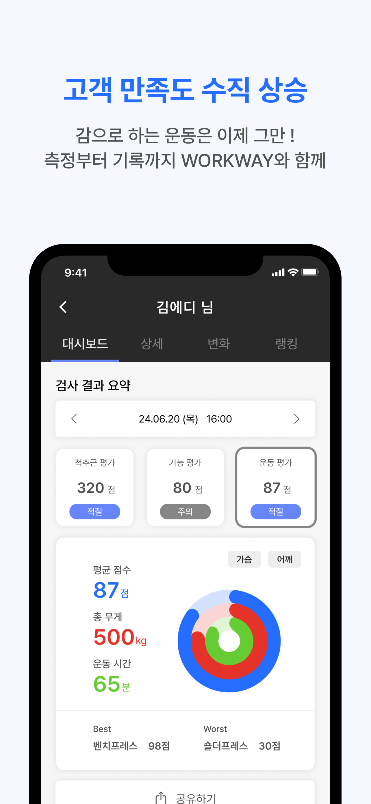
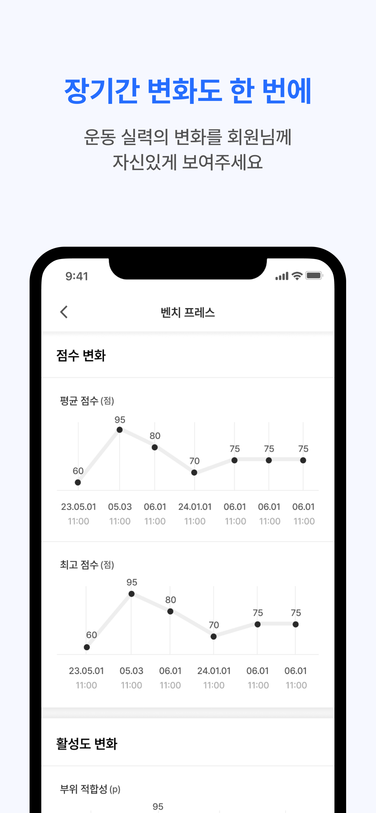
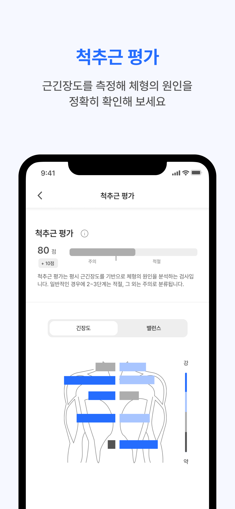
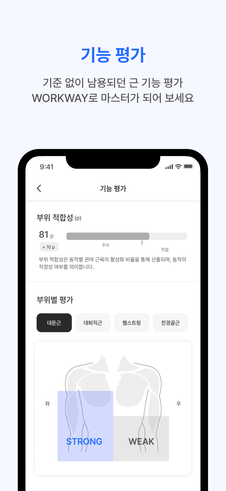
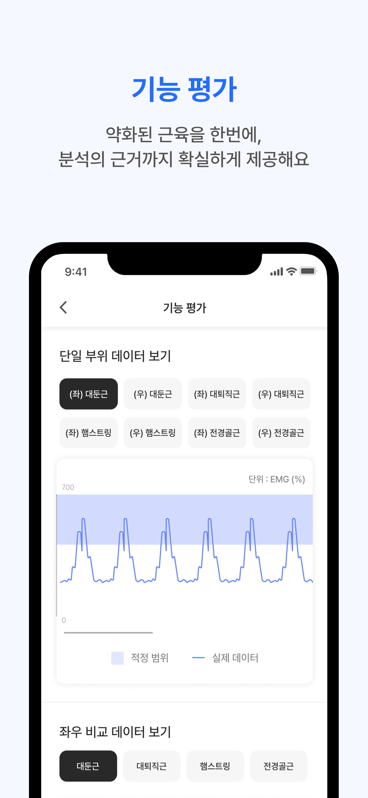
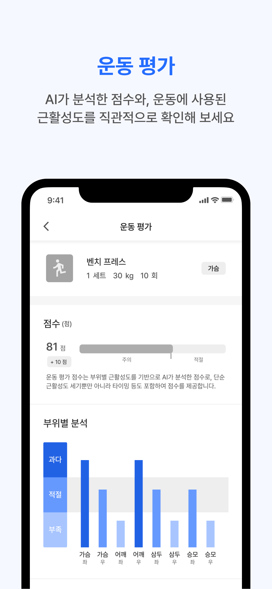
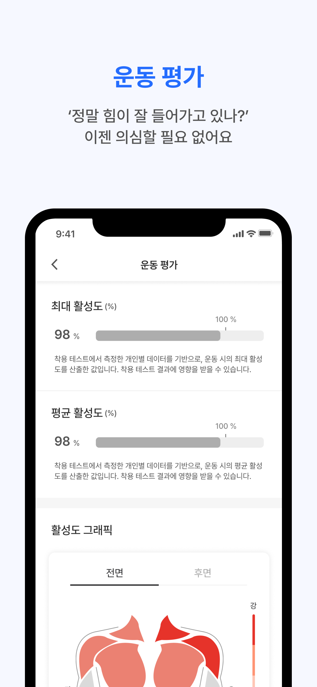

# WORKWAY PRO
AI 웨어러블 기반의 운동 분석 솔루션

**기간**: 2024년 7월 ~ 2025년 1월  
**기술스택**: SwiftUI, TCA, Swift Concurrency, Firebase, CoreBluetooth  
**프로젝트 인원**: 기획 & 디자인 1명, 개발 3명 (데이터 & AI 1명, 백앤드 & iOS 1명, iOS 1명)  
**AppStore**: [WORKWAY PRO](https://apps.apple.com/kr/app/workway-pro-%EC%9B%8C%ED%81%AC%EC%9B%A8%EC%9D%B4-%ED%94%84%EB%A1%9C/id6605929363)

### 기여도
- **앱 전반적인 설계 70%**  
- **UI 제작 90%**  
- **API 통신 20%** 
- **Firebase 20%**  
- **Bluetooth 통신 40%**

  
  

  
  
  
  
  

